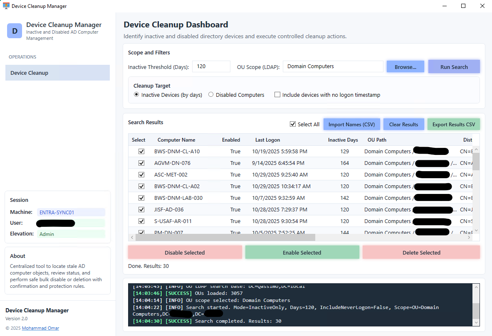

# 🧹 Device Cleanup Manager


---

## 📖 Overview

**Device Cleanup Manager** is a modern **WPF-based PowerShell** tool designed to centrally manage **Active Directory computer objects** for cleanup and control.

It provides a safe, structured interface to:

- Discover **Inactive devices** using `LastLogonDate` with a configurable **Days Inactive** threshold  
- Discover **Disabled computers** (`Enabled = False`)  
- Scope searches to a selected **OU (LDAP)** using a searchable browser  
- Import device names from **CSV** for bulk operations  
- Execute controlled actions (**Disable / Enable / Delete**) with confirmations and protection rules  
- Export results to CSV and track actions in a real-time **Message Center** log  

All application data is stored under:

```text
C:\ProgramData\DeviceCleanupManager
├── Logs
````

---

## 🖥 Screenshot



---

## ✨ Core Features

### 🔹 Search Modes

* **Inactive Devices (by days)**

  * Uses `LastLogonDate` and compares it to a cutoff date
  * Optional: include devices with **no logon timestamp**
* **Disabled Computers**

  * Uses server-side filter: `Enabled -eq $false`

---

### 🔹 OU Scope Selector

* Fast OU discovery via LDAP
* Searchable OU picker window
* Scope options:

  * **Entire Domain**
  * **Specific OU** (selected via Browse…)

---

### 🔹 Results Dashboard

* DataGrid with:

  * Select per-row (checkbox)
  * **Select All**
  * Full details:

    * Computer Name
    * Enabled
    * Last Logon Date
    * Inactive Days
    * OU Path (friendly)
    * Distinguished Name
    * Source (Search / CSV)

---

### 🔹 Bulk Actions

Actions are available for **Selected devices**:

* **Disable Selected**
* **Enable Selected**
* **Delete Selected**

All actions are protected by:

* Confirmation dialog (Yes/No)
* Protected DN rules (skip objects under protected OUs/DNs)

---

### 🔹 CSV Import (Bulk List Mode)

Import a list of devices (names only) into the grid for actions.

Supported columns:

* `ComputerName`
* `Name`

Example:

```csv
ComputerName
PC-001
PC-002
LAB-010
```

Imported items are labeled:

* `Source = CSV`

If the DN is missing, the tool resolves the device in AD at action-time.

---

### 🔹 Export Results

Export current grid results to CSV:

* ComputerName
* Enabled
* LastLogonDate
* InactiveDays
* OUPath
* DistinguishedName
* Source

---

### 🔹 Message Center

Real-time console log with levels:

* INFO
* SUCCESS
* WARNING
* ERROR

Used for:

* Search start/end
* OU scope selection
* Import/export tracking
* Action results and failures
* LDAP/RSAT errors

---

## ⚙️ Requirements

### System

* Windows 10 / 11
* Domain connectivity (recommended)
* Run as **Admin** when your role/permissions require elevation

### Modules

Required (RSAT AD):

```powershell
ActiveDirectory
```

Install RSAT (Windows 10/11):

```powershell
Add-WindowsCapability -Online -Name Rsat.ActiveDirectory.DS-LDS.Tools~~~~0.0.1.0
```

---

## 🧠 Inactivity Logic (Important)

The tool uses:

* `Get-ADComputer ... -Properties LastLogonDate`

`LastLogonDate` is derived from **lastLogonTimestamp replication**.

✅ Suitable for cleanup reporting and identifying stale objects
⚠ Not a real-time “last logon across all DCs” metric

---

## 🚀 How to Run

### Option 1 — PowerShell Script

```powershell
Set-ExecutionPolicy Bypass -Scope Process -Force
.\DeviceCleanupManager.ps1
```

### Option 2 — Packaged EXE

Run:

```text
DeviceCleanupManager.exe
```

---

## 🔄 Typical Workflow

1. Launch tool
2. Choose **Mode**

   * Inactive Devices (set Days)
   * Disabled Computers
3. Select **OU Scope**

   * Browse… → search and pick OU
4. Click **Run Search**
5. Review results and check devices
6. Execute actions:

   * Disable / Enable / Delete Selected
7. Export results if needed

---

## 🛡 Operational Safeguards

* RSAT AD module validation before AD operations
* Confirmation prompts for destructive actions
* Protected DN rule evaluation before actions
* Safe refresh logic after actions (updates grid state)
* CSV import supports “names-only” lists (resolved on action)

---

## 📁 Folder Structure

```text
C:\ProgramData\DeviceCleanupManager\
 ├── Logs\
```

---

## ⚠ Disclaimer

This tool is provided **as-is**.

* Test in a staging OU before production use
* Validate permissions and organizational policies
* Deleting AD computer objects is irreversible unless you rely on AD Recycle Bin / backups

---

## 👤 Author

* **Mohammad Abdelkader**
* Website: **momar.tech**
* Version: **2.0**
* Date: **2026-02-25**

---

## 📜 License

This project is licensed under the [MIT License](https://opensource.org/licenses/MIT).
