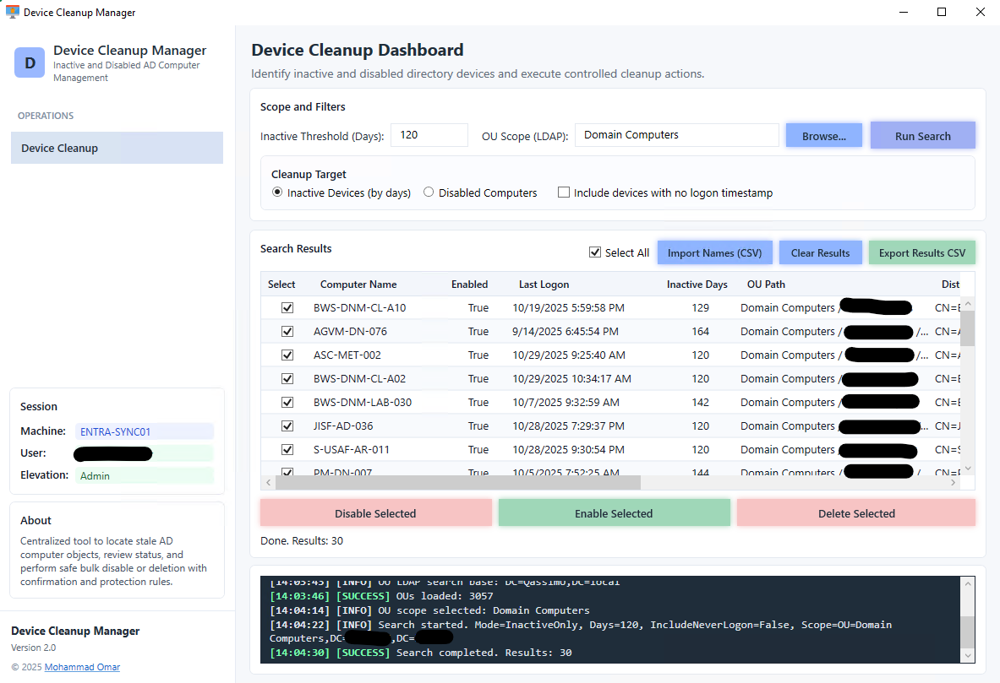

# 🧹 Device Cleanup Manager


[](https://www.buymeacoffee.com/mabdulkadrx)

---

## 📖 Overview

**Device Cleanup Manager** is a modern WPF-based PowerShell tool designed to centrally manage **Active Directory computer objects** for cleanup and control.

It provides a safe, structured interface to:

- Discover **Inactive devices** using `LastLogonDate` with a configurable **Days Inactive** threshold
- Discover **Disabled computers** (`Enabled = False`)
- Scope searches to a selected **OU (LDAP)** using a searchable browser
- Import device names from **CSV** for bulk operations
- Execute controlled actions (**Disable / Enable / Delete**) with confirmations and protection rules
- Export results to CSV and track actions in a real-time **Message Center** log

---

## 🖥 Screenshot



---

## ✨ Core Features

### 🔹 Search Modes
- **Inactive Devices (by days)**
  - Uses `LastLogonDate` and compares it to a cutoff date
  - Optional: include devices with **no logon timestamp**
- **Disabled Computers**
  - Uses server-side filter: `Enabled -eq $false`

### 🔹 OU Scope Selector
- Fast OU discovery via LDAP
- Searchable OU picker window
- Scope options:
  - **Entire Domain**
  - **Specific OU** (selected via Browse…)

### 🔹 Results Dashboard
DataGrid with:
- Select per-row (checkbox)
- **Select All**
- Full details: Computer Name, Enabled, Last Logon Date, Inactive Days, OU Path, Distinguished Name, Source (Search / CSV)

### 🔹 Bulk Actions
Actions available for **Selected devices**:
- **Disable Selected**
- **Enable Selected**
- **Delete Selected**

All actions are protected by:
- Confirmation dialog (Yes/No)
- Protected DN rules (skip objects under protected OUs/DNs)

### 🔹 CSV Import (Bulk List Mode)
Import a list of devices (names only) into the grid for actions.

Supported columns: `ComputerName`, `Name`

```csv
ComputerName
PC-001
PC-002
LAB-010
```

Imported items are labeled `Source = CSV`. If the DN is missing, the tool resolves the device in AD at action-time.

### 🔹 Export Results
Export current grid results to CSV:
- ComputerName, Enabled, LastLogonDate, InactiveDays, OUPath, DistinguishedName, Source

### 🔹 Message Center
Real-time console log with levels: INFO, SUCCESS, WARNING, ERROR

Used for: Search start/end, OU scope selection, Import/export tracking, Action results and failures, LDAP/RSAT errors

---

## ⚙️ Requirements

### System
- Windows 10 / 11
- Domain connectivity (recommended)
- Run as **Admin** when your role/permissions require elevation

### Modules

Required (RSAT AD):

```powershell
ActiveDirectory
```

Install RSAT (Windows 10/11):

```powershell
Add-WindowsCapability -Online -Name Rsat.ActiveDirectory.DS-LDS.Tools~~~~0.0.1.0
```

---

## 🧠 Inactivity Logic (Important)

The tool uses `Get-ADComputer ... -Properties LastLogonDate`.

`LastLogonDate` is derived from **lastLogonTimestamp replication**.

- ✅ Suitable for cleanup reporting and identifying stale objects
- ⚠ Not a real-time "last logon across all DCs" metric

---

## 🚀 How to Run

### Option 1 — PowerShell Script

```powershell
Set-ExecutionPolicy Bypass -Scope Process -Force
.\DeviceCleanupManager.ps1
```

### Option 2 — Packaged EXE (Self-Signed with PSWrap)

The `.exe` was compiled and self-signed using [PSWrap](https://github.com/mabdulkadr/PSWrap) — a PowerShell Script to EXE Compiler with built-in code signing support.

```
DeviceCleanupManager.exe
```

No PowerShell console required.

---

## 🔄 Typical Workflow

1. Launch tool
2. Choose **Mode**: Inactive Devices (set Days) or Disabled Computers
3. Select **OU Scope**: Browse → search and pick OU
4. Click **Run Search**
5. Review results and check devices
6. Execute actions: Disable / Enable / Delete Selected
7. Export results if needed

---

## 🛡 Operational Safeguards

- RSAT AD module validation before AD operations
- Confirmation prompts for destructive actions
- Protected DN rule evaluation before actions
- Safe refresh logic after actions (updates grid state)
- CSV import supports "names-only" lists (resolved on action)

---

## 📁 Folder Structure

```
C:\ProgramData\DeviceCleanupManager\
 ├── Logs\
```

---

## 🐛 Troubleshooting

| Symptom | Likely Cause | Fix |
|---------|--------------|-----|
| OU list doesn't load | Not connected to domain or no LDAP access | Ensure domain connectivity; check firewall |
| "RSAT module not found" | ActiveDirectory module not installed | Install RSAT via `Add-WindowsCapability` (see Requirements) |
| Search returns no results | Days threshold too low or wrong OU scope | Increase Days Inactive or select "Entire Domain" |
| Delete/Disable fails | Protected DN rule or insufficient permissions | Check protected OUs; verify delegated AD rights |
| CSV import shows empty | Wrong column name in CSV | Use `ComputerName` or `Name` column header |

---

## 📜 License

This project is licensed under the [MIT License](https://opensource.org/licenses/MIT).

---

## 👤 Author

**Mohammad Abdulkader Omar** 
Website: https://momar.tech 
LinkedIn: https://www.linkedin.com/in/mabdulkadr/ 
Version: **2.0** 

---

## ☕ Support

If this project helps you, consider supporting it:

[](https://www.buymeacoffee.com/mabdulkadrx)

---

## ⚠ Disclaimer

These scripts are provided as-is. Test them in a staging environment before applying them to production. The author is not responsible for any unintended outcomes resulting from their use.
